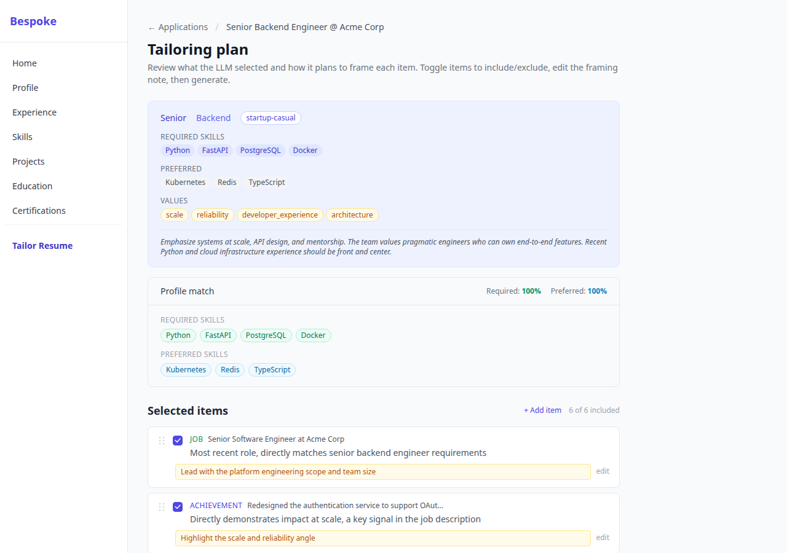
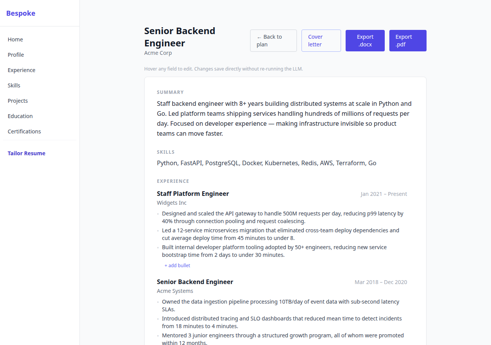
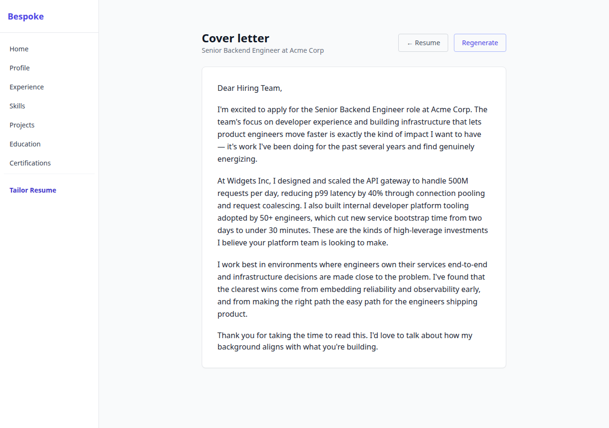

# Bespoke

A local-first resume tailoring tool that treats your career history as a structured database and uses a three-stage LLM pipeline to generate tailored resumes. The LLM selects and rewrites real achievements from your database — it never invents experience or fabricates metrics.

## Features

- **No fabrication, by construction.** The generator only sees data hydrated from rows in your career database — it literally cannot cite an achievement, metric, or employer that isn't there. Enforced by traceability tests, not just prompt instructions.
- **Human-in-the-loop plan review.** Generation is gated on a review step where you toggle, reorder, annotate, and add the items the LLM selected. Hallucinated or mis-scored picks get caught before any prose is written.
- **Versioned prompts with a compare CLI.** Every LLM stage records the `sha256[:12]` hash of the prompt that produced its output, so you can A/B prompt changes across sessions with `prompt_compare`.
- **Local-first.** SQLite on your disk. No accounts, no cloud sync, no telemetry.
- **Keyless demo mode.** `BESPOKE_MOCK_LLM=1` runs the full pipeline on fixture responses — no API key needed.
- **ATS-friendly exports.** Single-column `.docx` and `.pdf` renderers (no tables, no text boxes), with inline post-generation editing that flows straight into both.

## How it works

1. **Enter your career data once** — jobs, achievements, skills, projects, education.
2. **Paste a job description** — the analyzer extracts required/preferred skills, role level, tone signals, and emphasis guidance.
3. **Review the tailoring plan** — a second LLM pass selects which achievements to include, with rationale for each decision. Toggle items on/off, add emphasis notes, drag to reorder, or add items the LLM missed.
4. **Generate, polish, and export** — a third LLM pass writes resume prose. Edit any field or bullet inline on the result page (no LLM re-run). Export to `.docx` or `.pdf`.
5. **Optionally generate a cover letter** — grounded in the same plan items as the resume.

All LLM outputs are versioned by prompt hash (`sha256[:12]`) and stored in SQLite for later comparison.

## Screenshots

| Plan review | Generated resume | Cover letter |
|---|---|---|
|  |  |  |

## Setup (under 60 seconds)

**Prerequisites:** Python 3.11+, and an [OpenRouter](https://openrouter.ai) API key (create one at [openrouter.ai/keys](https://openrouter.ai/keys)) — or skip the key entirely and use mock mode (see [Development](#development)).

```bash
git clone https://github.com/nilomadison/bespoke.git
cd bespoke
python -m venv .venv && source .venv/bin/activate   # Windows: .venv\Scripts\activate
pip install -e ".[dev]"
```

Create your environment file:

```bash
cp .env.example .env
# Edit .env and set OPENROUTER_API_KEY=sk-or-...
```

Initialize the database and seed your career data:

```bash
cp data/seed.yaml.example data/seed.yaml
# Edit data/seed.yaml with your real career history
python -m src.db.seed
alembic stamp head
```

Run the app:

```bash
uvicorn src.web.app:app --reload
```

Open [http://localhost:8000](http://localhost:8000). The home dashboard shows recent sessions and a **Start a new tailoring** button — paste a job description and go.

### Environment variables

All config is read from the environment (or `.env`) in `src/config.py`:

| Variable | Default | Purpose |
|---|---|---|
| `OPENROUTER_API_KEY` | _(empty)_ | Required for real LLM calls. Get one at [openrouter.ai/keys](https://openrouter.ai/keys). |
| `BESPOKE_MOCK_LLM` | `false` | Set to `1` to run the whole pipeline on fixture responses — no API key needed. |
| `DEFAULT_MODEL` | `anthropic/claude-sonnet-4-6` | OpenRouter model id used for all stages. |
| `OPENROUTER_BASE_URL` | `https://openrouter.ai/api/v1` | Override only if proxying. |
| `DATA_DIR` | `data` | Where `bespoke.db` lives. |
| `DB_ECHO` | `false` | Set to `true` to log SQL (debugging). |

## Development

**Run without an API key** (uses fixture responses):

```bash
BESPOKE_MOCK_LLM=1 uvicorn src.web.app:app --reload
```

**Run tests:**

```bash
pytest
```

**Database migrations** (Alembic, SQLite):

```bash
alembic upgrade head       # apply new migrations to an existing db
alembic history            # see migration history
alembic current            # check current revision
```

**Wipe and reseed** (fresh start):

```bash
rm data/bespoke.db
python -m src.db.seed
alembic stamp head
```

> `alembic upgrade head` alone will fail on a blank database — the baseline migration is a no-op stub that assumes tables already exist. `python -m src.db.seed` builds the schema via `create_all()`, and `alembic stamp head` syncs the version table without re-running migrations.

## Project structure

```
src/
├── models/         SQLAlchemy 2 models (Job, Achievement, Skill, Project, …)
├── db/             Engine, session factory, init, seed CLI
├── llm/            OpenRouter client, mock client, prompt loader
├── tailor/         analyzer, planner, generator, cover_letter, resolver, scorer
├── render/         python-docx + reportlab renderers (.docx and .pdf)
├── web/
│   ├── routes/     FastAPI route handlers (one file per entity)
│   └── templates/  Jinja2 + HTMX + Tailwind templates
└── tools/          prompt_compare CLI

prompts/
├── analyze/        Stage 1: extract structured job requirements
├── plan/           Stage 2: select and prioritize career items
├── generate/       Stage 3: write resume prose
└── cover_letter/   Optional: write a cover letter from the plan

tests/              pytest, in-memory SQLite, MockLLMClient fixture
```

## Prompt comparison CLI

Compare two tailoring sessions to see how a prompt change affected output:

```bash
python -m src.tools.prompt_compare list
python -m src.tools.prompt_compare analyze <session_id_a> <session_id_b>
python -m src.tools.prompt_compare plan    <session_id_a> <session_id_b>
python -m src.tools.prompt_compare generate <session_id_a> <session_id_b>
python -m src.tools.prompt_compare cover_letter <session_id_a> <session_id_b>
```

Each mode compares the meaningful thing for that stage: field-by-field analysis diff, plan item additions/drops, experience bullet changes, and cover-letter paragraph diffs.

## Design notes

- **No fabrication.** Every bullet in the final resume is rewritten from a real achievement row in your database. The anti-hallucination test in `tests/test_generator.py` enforces this.
- **Sync SQLAlchemy, async httpx.** SQLite is sync; LLM calls run in a `ThreadPoolExecutor` via `asyncio.run()` to keep both patterns clean.
- **Prompt versioning.** `sha256[:12]` of each prompt file is stored on every `TailoringSession` at generation time. Run the same job description through two prompt versions and use the compare CLI to audit the difference.
- **Local-first.** No accounts, no cloud sync, no telemetry. Your career data stays in `data/bespoke.db`.

## AI Assistance
This project was developed with assistance from AI coding tools Claude Code.
- Refer to [CLAUDE.md](CLAUDE.md) for repository-specific guidelines, commands, and architecture notes.

## License

MIT — see [LICENSE](LICENSE).
